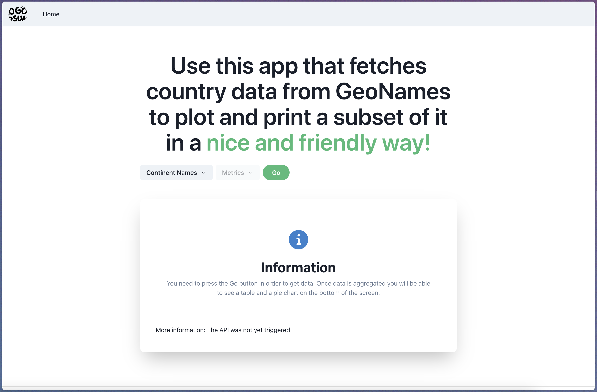
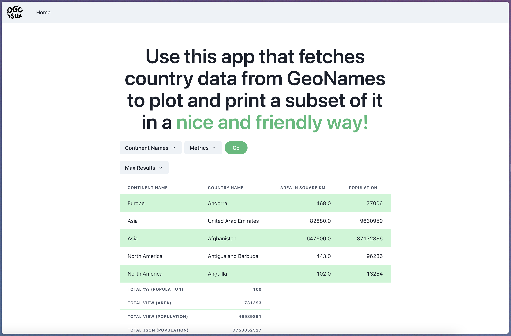

# frontend_case_study




## 📍 Getting Started

This is a [Next.js](https://nextjs.org/) project bootstrapped with [`create-next-app`](https://github.com/vercel/next.js/tree/canary/packages/create-next-app) command line.

**Step 1:**

Download or clone this repo by using the link below:

```
https://github.com/mohamis/frontend_case_study
```

**Step 2:**

Go to project root and execute the following command in console to get the required dependencies:

```
npm install
```

**Step 3:**
Run the project using dev command

```
npm run dev
```

The app should be available on [http://localhost:3000](http://localhost:3000), open it using your browser to see the result.

If you need to make modifications, the page auto-updates as you edit the file.

🥸 [API routes](https://nextjs.org/docs/api-routes/introduction) can be accessed on [http://localhost:3000/api/hello](http://localhost:3000/api/hello). This endpoint can be edited in `pages/api/hello.ts`, for now it only return data from http://api.geonames.org.

The `pages/api` directory is mapped to `/api/*`. Files in this directory are treated as [API routes](https://nextjs.org/docs/api-routes/introduction) instead of React pages.

## 🚀 Features:

- Minimalist design using Chakra UI
  Chakra UI - A simple, modular and accessible component ...https://chakra-ui.com
- API calls
- Api route under `pages/api/hello.ts`
- Fetch data from http://api.geonames.org/
- Table view for displaying data from the API.
- Pie Chart dynamically rendered based on the table
- Conditional rendering
- Metrics change the rendering of table
- Result number render a new chart
- Disabling some features if api was not triggered

### 🧰 Libraries & Tools Used

- [NextJS](https://nextjs.org/docs/api-reference/create-next-app)(for routing and API management, performance and fast access)
- [VSCode](https://code.visualstudio.com/)(My code editor)
- [ReactTable](https://tanstack.com/table/v8)(For table management)
- [chakraUI](https://chakra-ui.com/)(Minimalist design and component)
- [highcharts](https://www.highcharts.com/)(Used for pie chart)

### 👁 Consideration check-list

> A) Once website is loaded: ✅

> B) Button ‘Go’ click functionality ✅

> C) Changing value of any filter will automatically re-plot the chart and update the table results ✅

## 🌇 Reflection on my work

Unfortunately at the end of the day, I have seen that I didn't understood that the values under the table in the column ("population") needs to be displayed as percentages.

I followed the instructions from the pdf sent for the case study but I didn't offered a complete work.

You will find that I tried my best to code clean, but in the rush, I have made some bad decisions on the code and architecture of my project...

I try as much as possible to avoid rerendering the application on data changes. If you find any bugs or problems, please let me know.

⚠️ I have deliberately chosen to add the 200 results options to the dropdown menu, so we can see the data.

## 📺 Screenshots




---

#### Learn More

To learn more about Next.js, take a look at the following resources:

- [Next.js Documentation](https://nextjs.org/docs) - learn about Next.js features and API.
- [Learn Next.js](https://nextjs.org/learn) - an interactive Next.js tutorial.

You can check out [the Next.js GitHub repository](https://github.com/vercel/next.js/) - your feedback and contributions are welcome!
